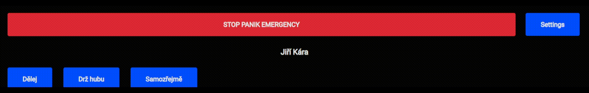

# ⚠ This is very early prototype! ⚠
# Soundboard based on JavaScript and Electron

## Quick intro
Everyone wants to play funny sound effects in voice chat, but every soundboard I found didn't met my expectations so I decided to make my own(sort of).
Currently it's very early build but maybe if I gave it more time and some polishing this can meet my expectations for ideal soundboard.

GUI is based on my [Wemos voicemeeter soundboard](https://github.com/smaartscz/Wemos-Voicemeeter/) but it's made to work independently.

# Requirements
Depending on your expectations you can run index.html via your browser or you can have a standalone app.
You need to have installed electron and electron-forge. Hopefully it will install required dependencies automatically.
## Build
You need to run a few commands.

`npm install --save-dev @electron-forge/cli`

`npx electron-forge import`

`npm run make`
