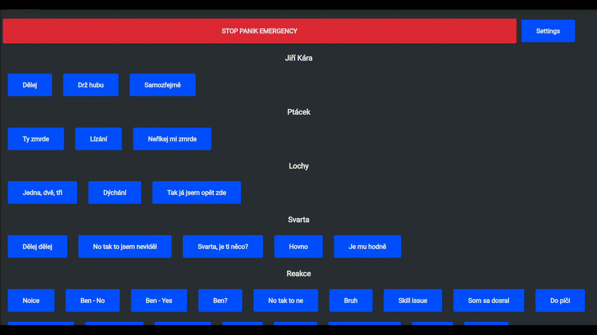

# Soundboard based on JavaScript and Electron

## Quick intro
Everyone wants to play funny sound effects in voice chat, but every soundboard I found didn't met my expectations so I decided to make my own(sort of).
Currently it's very early build but maybe if I gave it more time and some polishing this can meet my expectations for ideal soundboard.

GUI is based on my [Wemos voicemeeter soundboard](https://github.com/smaartscz/Wemos-Voicemeeter/) but it's made to work independently.
# Features
- Selecting custom audio output
- Creating new categories
- Creating new sounds
- Removing unwanted categories
- Removing unwanted sound effects
## Planned features
### [Feature update 2](../../milestone/2)
- Selecting custom audio volume
- Passthrough for your microphone (Right now you need to use some kind of audio mixer - for example [Voicemeeter](https://vb-audio.com/Voicemeeter/)
# Quick start guide
You can download executable from [releases](../../releases/). Install soundboard and open it.

In settings you select your audio device output and click save. Go back into settings and click on "Edit buttons".

Add new category and save it. Now you can add new sound effect.

You will need to enter name for sound effect, select category and finally upload audio file(mp3, wav).

Click on save and enjoy!

# Requirements
You need to have installed electron and electron-forge. Hopefully it will install required dependencies automatically.
## Build
You need to run a few commands.

`npm install --save-dev @electron-forge/cli`

`npx electron-forge import`

`npm run make`
