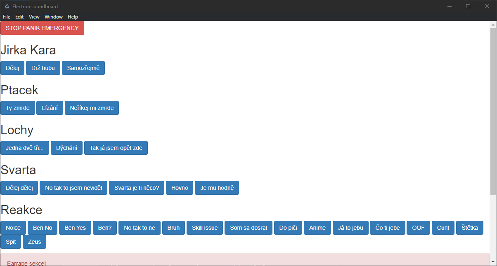

# ⚠ This is prototype!
# Soundboard based on JavaScript and Electron

## Quick intro
Everyone wants to play sound on voice chat, but every soundboard didn't met my expectations so I decided to make my own(sort of).
Currently it's very early build but maybe if I gave it more time and some polishing this can meet my expectations for ideal soundboard.

GUI is based on my [Wemos voicemeeter soundboard](https://github.com/smaartscz/Wemos-Voicemeeter/) but it's made to work independently.
# Build

## Requirements

# Sources
- [Create a Sound Board in 3 lines of code](https://dev.to/aneeqakhan/create-a-sound-board-in-3-lines-of-code-3ho8)

