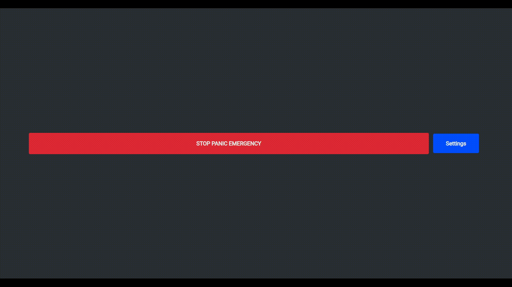

# Soundboard based on JavaScript and Electron

## Quick intro
Everyone wants to play funny sound effects in voice chat, but every soundboard I found didn't met my expectations so I decided to make my own(sort of).
Currently it's very early build but maybe if I gave it more time and some polishing this can meet my expectations for ideal soundboard.

GUI is based on my [Wemos voicemeeter soundboard](https://github.com/smaartscz/Wemos-Voicemeeter/) but it's made to work independently.
# Features
- Selecting custom audio output
- Creating new categories
- Creating new sounds
- Removing unwanted categories
- Removing unwanted sound effects
- Selecting custom audio volume
- Passthrough for your microphone(With help from Virtual Audio Cable)
- Allow user to set custom color for buttons
- Add localization
- Allow to import/export settings
- Add remote API for playing sound effects 

## Remote control
Right now there are no available clients for remote control.

Comming soon!

# Quick start guide
You can download executable from [releases](../../releases/). Install soundboard and open it.

In settings you select your audio device output and click save. Go back into settings and click on "Edit buttons".

Add new category and save it. Now you can add new sound effect.

You will need to enter name for sound effect, select category color if you want and finally upload audio file(mp3, wav).

Click on save and enjoy!

## Allowing microphone passthrough
If you want to play sounds on voicechat you will need to create virtual audio input and output

Easiest way to do it is via [VB-Cable](https://vb-audio.com/Cable/index.htm), just follow installation guide on official website and then select "VB-Cable" as your audio output.

Don't forget to set correct microphone input and allow microphone passthrough!

After all of this, just set VB-Cable as your audio input in discord!

# Requirements
You need to have installed electron and electron-forge. Hopefully it will install required dependencies automatically.
## Build
You need to run a few commands.

`npm install --save-dev @electron-forge/cli`

`npx electron-forge import`

`npm run make`
